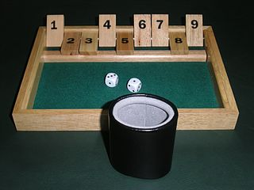

# Shut the Box

A Python (2.7) implementation of the dice game, by default using the standard rules as described in the [Wikipedia article](https://en.wikipedia.org/wiki/Shut_the_Box): briefly using flaps numbered 1 to 9 and rolling two dice (optionally one die if the sum of the flaps is 6 or less). The score is the sum of the flaps still raised when the player's turn ends.

Scripts are provided to play the game interactively (`human-game.py`) or to simulate many games (`simulate-*.py`) and output the scores. In the case of simulation, 'decision' methods (e.g. `make_flap_decision_highest`) are used to decide how many dice to roll in the event of the sum of the flaps being 6 or less and which flaps to lower after each roll. Feel free to extend the code by providing further decision methods. Pull requests are welcome.

Unit tests are provided in the `tests/` directory for methods that don't require human input. Run them using `nosetests`.

Feel free to get in touch on [Twitter](https://twitter.com/gregrs_uk).

Copyright &copy; [gregrs-uk](https://gregrs-uk.github.io) 2018
